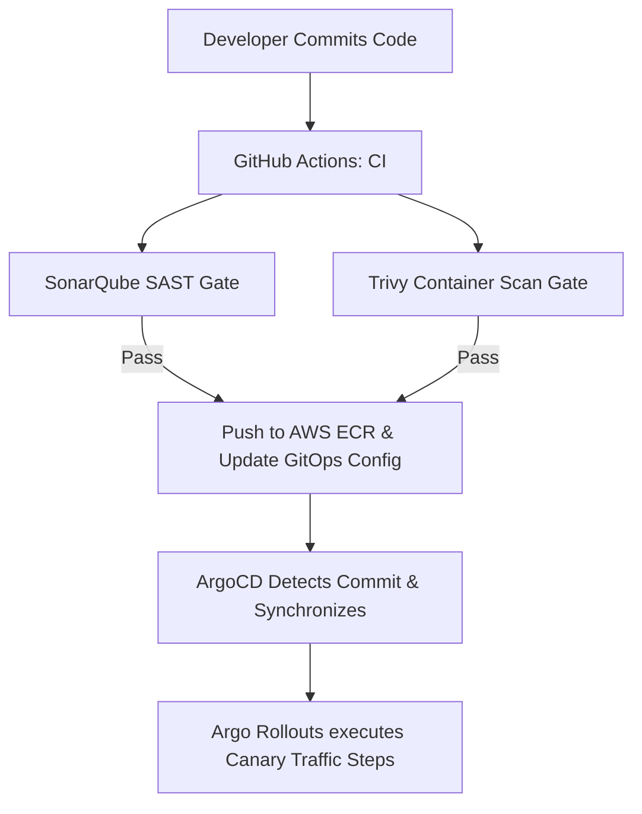

# GitOps DevSecOps Pipeline & Canary Releases (ArgoCD + Argo Rollouts + Kyverno)

This repository implements the end-to-end GitOps deployment pipeline and progressive delivery framework designed for **USAA's AWS EKS** environment. It leverages **ArgoCD** for pull-based synchronization, **Argo Rollouts** for Prometheus-analyzed Canary releases, **Kyverno** for admission policy governance, and integrates with **ServiceNow, Jira, and Microsoft Teams** to log release states and deployment failure incidents.

---

## 🏗️ Repository Layout

```text
gitops_devsecops/
├── kubernetes/
│   ├── argo-appset.yaml            # ArgoCD ApplicationSet syncing regional clusters
│   ├── argo-rollout.yaml           # Argo Rollout object with Prometheus analysis
│   └── kyverno-policy.yaml         # Kyverno ClusterPolicy restricting root container execution
├── Use-case_docs.md                # Detailed architecture description
└── README.md                       # Setup and deployment guide
```

---

## 🔧 Component Details

### 1. Kubernetes Configurations
*   `argo-appset.yaml` defines the declarative Multi-Cluster synchronization mapping.
*   `argo-rollout.yaml` defines the Canary release traffic weights and Prometheus metrics query checks.
*   `kyverno-policy.yaml` deploys the policy engine rules blocking insecure resource specs.

### 2. DevSecOps Delivery Flow



---

## 🚀 Deployment & Verification

### Step 1: Validate Kubernetes Manifests
Run YAML validation to check the syntax:
```bash
python -c "import yaml; yaml.safe_load(open('kubernetes/argo-appset.yaml'))"
python -c "import yaml; yaml.safe_load(open('kubernetes/argo-rollout.yaml'))"
python -c "import yaml; yaml.safe_load(open('kubernetes/kyverno-policy.yaml'))"
```
