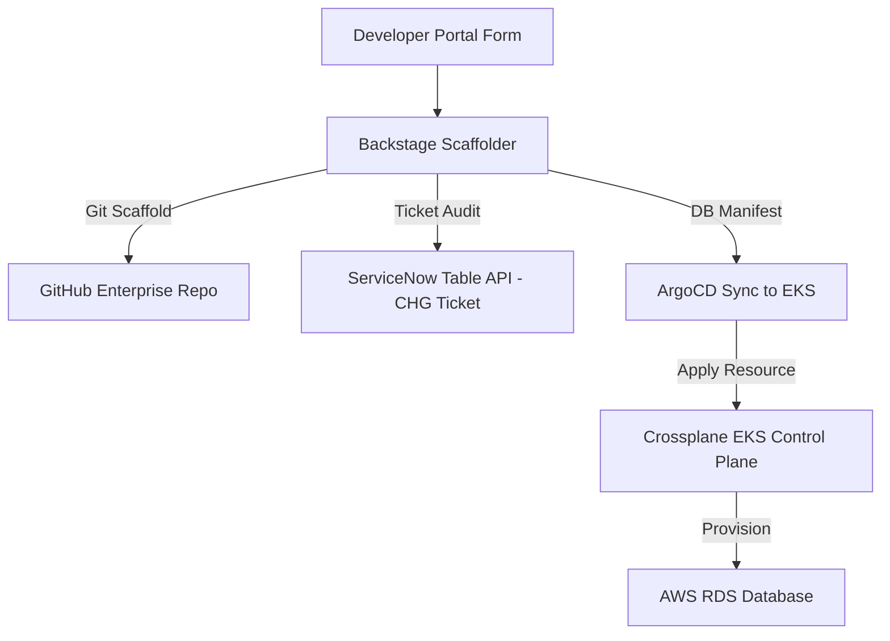

# Internal Developer Platform & Self-Service Golden Paths (Backstage + EKS + Crossplane)

This repository implements the end-to-end Internal Developer Platform (IDP) and self-service infrastructure provisioning framework designed for **USAA's AWS EKS** environment. It leverages **Spotify Backstage** for software catalog registration and golden path scaffolding templates, **Crossplane** for EKS-native database provisioning, and integrates with **ServiceNow, Jira, and Microsoft Teams** to log change tickets and provision status events.

---

## 🏗️ Repository Layout

```text
internal_developer_platform/
├── kubernetes/
│   ├── backstage-template.yaml     # Backstage Software Template (Golden Path)
│   └── crossplane-db.yaml          # Crossplane custom resource for RDS Database
├── Use-case_docs.md                # Detailed architecture description
└── README.md                       # Setup and deployment guide
```

---

## 🔧 Component Details

### 1. Kubernetes Configurations
*   `backstage-template.yaml` defines the Backstage Scaffolder steps to create GitHub repos and trigger ServiceNow change tickets.
*   `crossplane-db.yaml` defines the RDS Custom Resource provisioned in AWS by Crossplane.

### 2. Self-Service Provisioning Flow



---

## 🚀 Deployment & Verification

### Step 1: Validate Kubernetes Manifests
Run YAML validation to check the syntax:
```bash
python3 -c "import yaml; list(yaml.safe_load_all(open('kubernetes/backstage-template.yaml'))); list(yaml.safe_load_all(open('kubernetes/crossplane-db.yaml')))"
```
