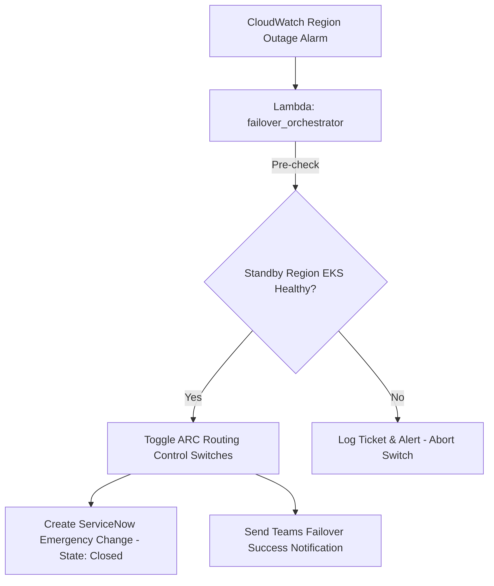

# Multi-Region Active-Passive DR & Routing (Route 53 ARC + EKS)

This repository implements the end-to-end multi-region Active-Passive Disaster Recovery and traffic routing framework designed for **USAA's AWS EKS** banking API core. It leverages **AWS Route 53 ARC (Application Recovery Controller)** for sub-2 minute DNS failovers, **DynamoDB Global Tables** for millisecond cross-region data replication, and integrates with **ServiceNow, Jira, and Microsoft Teams** to log and alert on failover events.

---

## 🏗️ Repository Layout

```text
multi_region_dr/
├── terraform/
│   ├── providers.tf                # AWS provider configurations
│   ├── arc.tf                      # Route 53 ARC clusters, controls, and panel
│   ├── dynamodb.tf                 # DynamoDB Global Tables replication setup
│   └── variables.tf                # Region and naming configuration variables
├── lambda/
│   └── failover_orchestrator/
│       └── index.py                # Python orchestrator executing failover switches
├── Use-case_docs.md                # Detailed architecture description
└── README.md                       # Setup and deployment guide
```

---

## 🔧 Component Details

### 1. Infrastructure as Code (Terraform)
*   `arc.tf` configures Route 53 ARC routing controls and links them to Route 53 routing records.
*   `dynamodb.tf` configures DynamoDB tables with multi-region replication.

### 2. Automation & Ticketing Flow
The orchestrator Lambda in `lambda/failover_orchestrator/index.py` handles the failover validation:



---

## 🚀 Deployment & Verification

### Step 1: Validate Terraform Configurations
Run validation locally to ensure syntax and structure correctness:
```bash
cd terraform
terraform init -backend=false
terraform validate
```

### Step 2: Validate Lambda Code Compilation
Verify Python compilation:
```bash
python -m py_compile ../lambda/failover_orchestrator/index.py
```
