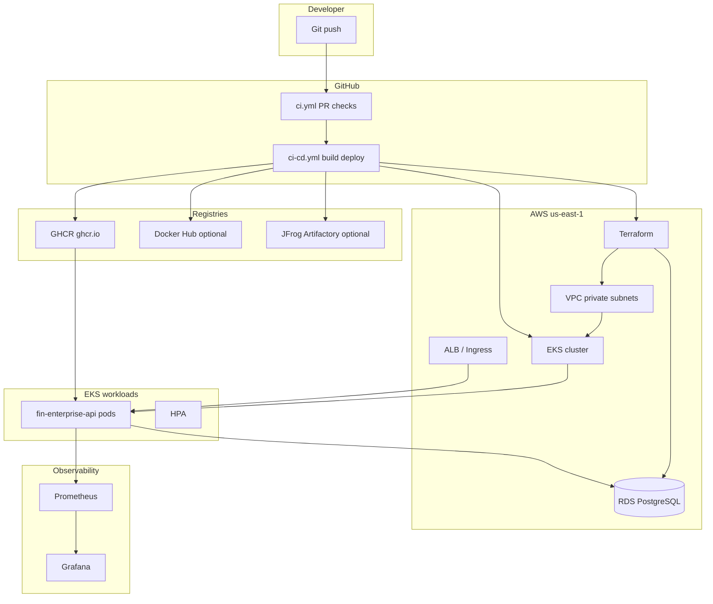

# 1-Hour Demo Script — EKS & Cloud Infrastructure Deployment

**Project:** Financial Enterprise Application  
**Audience:** Hiring panel / technical stakeholders (adjust depth with notes below)  
**Recommended mode:** **Hybrid** — local app + Kind K8s + Terraform plan on screen; optional live EKS if cluster exists

---

## Before you start (5 min prior)

| Check | Action |
|-------|--------|
| Docker running | `docker compose ps` — all healthy |
| API docs | http://localhost:8000/docs |
| Grafana | http://localhost:3000/login (`admin` / `changeme`) |
| Tabs open | See [Files to have open](#files-to-have-open) |
| Kind (optional) | `make kind-up && make kind-apply` |
| AWS CLI (optional) | `aws sts get-caller-identity` |

---

## Files to have open

| Order | File | Why |
|-------|------|-----|
| 1 | `docs/ARCHITECTURE.md` | Opening diagram |
| 2 | `app/main.py` | API + health + metrics |
| 3 | `.github/workflows/ci-cd.yml` | Pipeline story |
| 4 | `terraform/aws/main.tf` | VPC, EKS, RDS |
| 5 | `k8s/base/deployment.yaml` | Probes, security, image |
| 6 | `k8s/overlays/staging/kustomization.yaml` | Env promotion |
| 7 | `checkov.yaml` | Security gate |
| 8 | `docs/KIND_ARGOCD.md` or Argo CD UI | GitOps closer |

---

## Architecture slide (draw or show)



**One-liner:** Git triggers CI/CD → scanned image lands in registry → Terraform provisions VPC/EKS/RDS → Kubernetes runs the API → Prometheus watches RED metrics.

---

## Minute-by-minute script (60 min)

### 0:00–0:05 — Opening & business context

**Say:**
> “I built an institutional **Financial Enterprise** platform: portfolios, holdings, and NAV snapshots. Today I’ll show how we take this API from code to **AWS EKS** with Terraform, automated CI/CD, and observability — the same patterns you’d use in a regulated finance environment.”

**Show:** `docs/ARCHITECTURE.md` (business table)

**Panel tip:** Mention compliance needs: encryption, audit logs, no public DB.

---

### 0:05–0:12 — Application layer (what we deploy)

**Say:**
> “The workload is a **FastAPI** service with async **PostgreSQL**. Health is split: `/health` is process-up; `/ready` checks the database — that drives Kubernetes readiness.”

**Live demo:**
1. Open http://localhost:8000/docs  
2. **POST** `/api/v1/portfolios` — example body:
   ```json
   {"name": "Core Fixed Income Fund", "strategy": "core_fixed_income", "base_currency": "USD"}
   ```
3. Show http://localhost:8000/metrics (Prometheus format)

**Show files:** `app/main.py` (lifespan, middleware, probes), `app/routers/portfolios.py`

**Beginner:** Skip SQLAlchemy; focus on Swagger.  
**Panel:** Mention Alembic migrations in `database/migrations/`.

---

### 0:12–0:20 — CI/CD: trust the artifact before EKS

**Say:**
> “Nothing reaches EKS without passing **lint, tests, SAST, container scan, and IaC scan**. PRs run fast checks; merge to `main` runs the full CD pipeline.”

**Show:** `.github/workflows/ci.yml` (PR) vs `.github/workflows/ci-cd.yml` (main)

**Walk through `ci-cd.yml` jobs:**

| Job | Purpose | Interview hook |
|-----|---------|----------------|
| `build-scan-push` | Docker build, **Trivy**, push **GHCR** (+ optional Hub / Artifactory) | Supply chain |
| `terraform-plan` | `terraform validate/plan` + **Checkov** | Shift-left security |
| `deploy-kind` | Kind cluster on runner; pull GHCR image → `kind load` → `k8s/overlays/local` | Same as laptop `make kind-apply`, but image is the **SHA tag from CI** |
| `deploy-staging` | `kubectl apply -k k8s/overlays/staging` (EKS) | **Opt-in:** set repo variable `EKS_STAGING_ENABLED=true` + `AWS_ROLE_ARN`; GitOps alternative: Argo CD |
| `deploy-prod-gcp-dr` | Manual workflow to GKE | Hybrid DR |

**Say:**
> “We use **OIDC** (`AWS_ROLE_ARN`) so GitHub never stores long-lived AWS access keys.”

**Optional live:** GitHub Actions tab → latest `CI/CD` workflow run.

---

### 0:20–0:35 — Terraform & AWS cloud infrastructure (core section)

**Say:**
> “**Infrastructure is code** in `terraform/aws`. One apply creates networking, the **EKS** control plane, node groups, and **RDS** — no click-ops for staging/prod.”

**Show:** `terraform/aws/main.tf`

**Talk track — VPC module (`terraform/modules/aws-vpc/`):**
- Private subnets for EKS nodes and RDS  
- Public subnets + NAT for outbound only  
- **Why:** DB and pods have no public IPs  

**Talk track — RDS:**
- `storage_encrypted = true`  
- `publicly_accessible = false`  
- `multi_az` in prod  
- `manage_master_user_password` → Secrets Manager integration  

**Talk track — EKS (terraform-aws-modules/eks):**
- Managed node groups: min/max/desired by environment  
- `cluster_enabled_log_types` — audit trail  
- API endpoint: public with CIDR restriction in real prod (`authorized_api_cidrs`)  

**Show:** `terraform/aws/bootstrap/main.tf` — S3 state + DynamoDB lock

**Live demo (no AWS cost):**
```bash
cd terraform/aws
terraform init -backend=false
terraform validate
terraform plan -var="environment=staging" -input=false
```

**Say:**
> “In CI, **Checkov** runs on every plan — misconfigs fail the pipeline before `apply`.”

**Show:** `checkov.yaml`, `.github/workflows/terraform-apply.yml` (manual plan/apply with environment approval)

**Panel Q&A prep:**
- **State drift?** Scheduled `terraform plan` alerts.  
- **Blast radius?** Workspaces / separate state per env.  
- **Cost?** `t3.large` nodes, desired=2 staging, RDS `db.t4g.medium`.

---

### 0:35–0:50 — EKS deployment (Kubernetes)

**Say:**
> “Kubernetes manifests are **Kustomize** bases + overlays. Same YAML goes to Kind locally and EKS in AWS — only image registry and secrets change.”

**Show:** `k8s/base/deployment.yaml`

| Field | Explain |
|-------|---------|
| `readinessProbe` → `/ready` | No traffic until DB OK |
| `livenessProbe` → `/health` | Restart unhealthy pods |
| `resources` requests/limits | Scheduling + cap noisy neighbor |
| `runAsNonRoot` | Security baseline |
| `securityContext` | finenterprise user in image |

**Show:** `k8s/base/hpa.yaml` — scale 2–10 on CPU 70%  
**Show:** `k8s/base/ingress.yaml` — TLS + host `api.fin-enterprise.example.com`  
**Show:** `k8s/overlays/staging/` — namespace + env patch  

**CD deploy snippet** (from `ci-cd.yml`):
```yaml
aws eks update-kubeconfig --name fin-enterprise-staging-eks --region us-east-1
kubectl apply -k k8s/overlays/staging
kubectl set image deployment/fin-enterprise-api api=...
kubectl rollout status deployment/fin-enterprise-api -n fin-enterprise-staging
```

**Live demo — Kind (if AWS not available):**
```bash
make kind-up
make kind-apply
curl http://localhost:30080/health
kubectl get pods -n fin-enterprise-local
```

**Say:**
> “This is the same manifest path Argo CD syncs in GitOps mode — see `argocd/applications/fin-enterprise-api-local.yaml`.”

**Whiteboard flow:**
```
Internet → ALB → Ingress → Service:80 → Pod:8000 → RDS:5432
```

---

### 0:50–0:56 — Observability & operations

**Say:**
> “We instrument the app with **Prometheus** counters and histograms. Grafana dashboards show request rate, P95 latency, and 5xx errors.”

**Live demo:**
- http://localhost:9090 — Prometheus targets  
- http://localhost:3000 — Grafana → Financial Enterprise API dashboard  
- `observability/prometheus/alerts.yml` — `FinEnterpriseApiDown`, high error rate  

**Show:** `docs/RUNBOOK.md` — rollback: `kubectl rollout undo`

**Say:**
> “For prod DR we have a **GKE** slice in GCP (`terraform/gcp/`) — warm standby, not active-active, to avoid split-brain.”

---

### 0:56–1:00 — Close & Q&A hooks

**Say:**
> “Summary: **Terraform** provisions secure AWS networking and EKS; **CI/CD** ships scanned images; **Kubernetes** runs the API with probes and HPA; **Prometheus/Grafana** give SRE visibility. Locally we prove the same YAML on **Kind** and optional **Argo CD** GitOps.”

**Strong closing lines:**
- “I can demo a failed rollout and rollback in under 2 minutes.”  
- “Checkov + Trivy are non-negotiable gates before deploy.”  
- “RDS stays outside the cluster — stateful data on managed Postgres.”

---

## Audience adjustments

| Audience | Cut | Add |
|----------|-----|-----|
| **Beginners** | Terraform module internals, GCP DR | More Swagger demo, Docker Compose diagram |
| **Hiring panel** | Long Docker Compose section | OIDC, Checkov, Multi-AZ, GitOps, failure/rollback story |
| **Managers** | kubectl details | CI gates, uptime, cost, timeline to prod |

---

## Demo modes

### Mode A — Hybrid (recommended, no AWS spend)

| Segment | Tool |
|---------|------|
| App | `make docker-up` + `/docs` |
| K8s | `make kind-apply` |
| IaC | `terraform plan` only |
| GitOps | Mention Argo CD + `docs/KIND_ARGOCD.md` |

### Mode B — Live AWS EKS

Requires: EKS cluster `fin-enterprise-staging-eks` already applied.

```bash
aws eks update-kubeconfig --name fin-enterprise-staging-eks --region us-east-1
kubectl apply -k k8s/overlays/staging
kubectl get pods -n fin-enterprise-staging -w
```

### Mode C — GitHub-only

Screen-share Actions runs + Terraform plan artifact + pre-recorded `kubectl get pods` clip.

---

## Likely questions & answers

| Question | Answer |
|----------|--------|
| Why EKS vs EC2? | Rolling deploys, HPA, standard K8s skills, IAM integration |
| Why RDS vs Postgres in K8s? | Backups, Multi-AZ, ops maturity for finance data |
| How do secrets reach pods? | K8s Secret today; prod → External Secrets + AWS SM |
| How do you rollback? | `kubectl rollout undo` or revert git + Argo sync |
| How is IaC secured? | Checkov in CI, encrypted S3 state, no secrets in TF |
| Multi-cloud why? | DR / regulatory — GCP warm standby, AWS primary |
| Cost control? | Smaller nodes in staging, autoscaling bounds, RDS class vars |

---

## Related docs

- [EKS_DEMO_CHECKLIST.md](EKS_DEMO_CHECKLIST.md) — prep & AWS bootstrap steps  
- [ARCHITECTURE.md](ARCHITECTURE.md)  
- [KIND_ARGOCD.md](KIND_ARGOCD.md)  
- [INTERVIEW_PREP.md](INTERVIEW_PREP.md)  
- [RUNBOOK.md](RUNBOOK.md)
