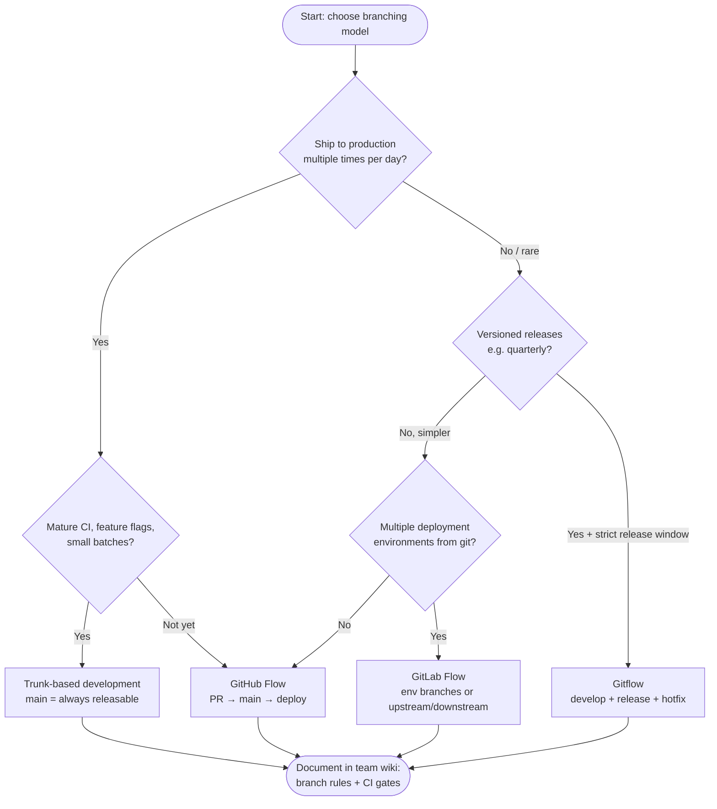
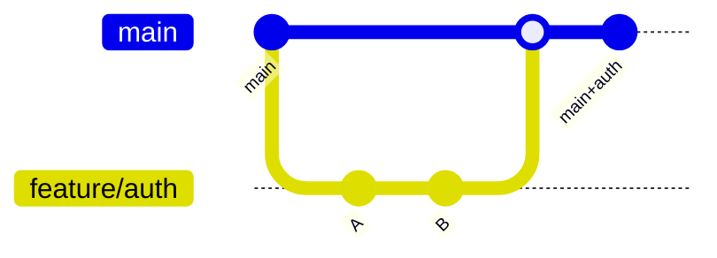
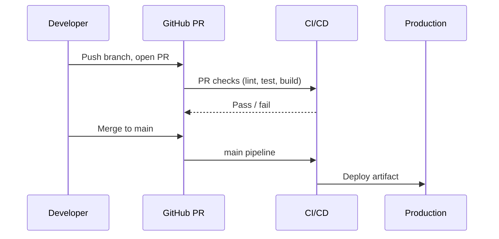
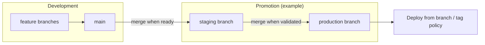
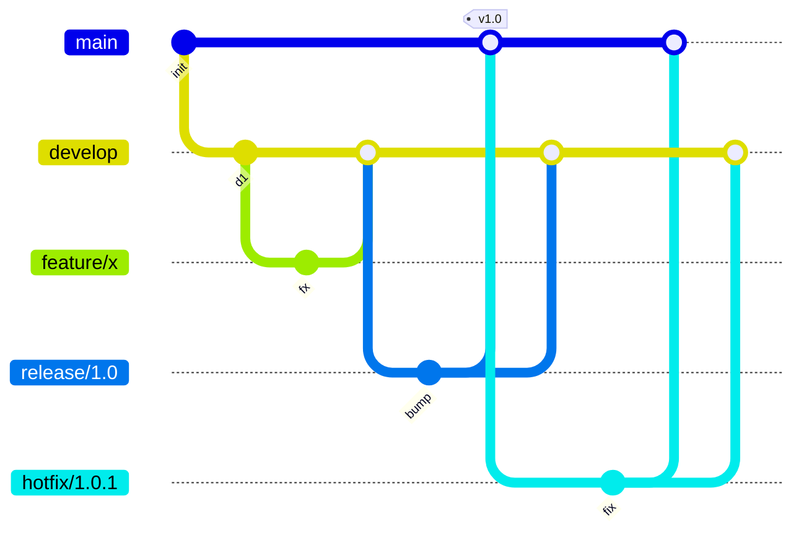
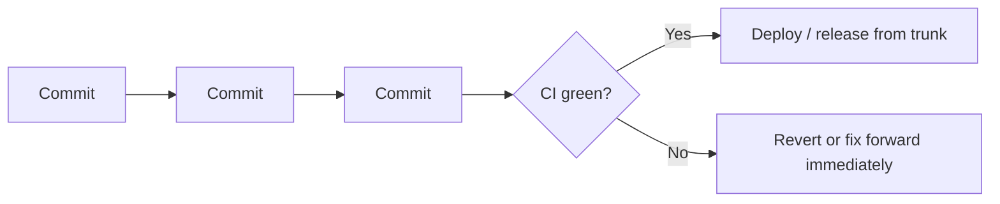

# SOP: Choosing a Git Branching Strategy

**Document type:** Standard operating procedure + decision guide  
**Audience:** Junior engineers, new team members, platform squads aligning with delivery  
**Owner:** Engineering / DevOps (review annually or when release cadence changes)  
**Version:** 1.0  

---

## 1. Purpose

Branching strategy answers: **where does work land**, **what is deployable**, and **how CI/CD maps to risk**. The wrong choice creates merge pain, stale branches, or production surprises. This SOP gives **criteria**, **comparisons**, and a **decision path**—not dogma.

**Interactive classifier:** For a guided questionnaire that ranks strategies from your answers (same heuristics as §4–§6), open [`docs/branching-strategy-tool/index.html`](branching-strategy-tool/index.html) in a browser (double-click for `file://`, or serve the `docs/` folder with any static file server, e.g. `python3 -m http.server 8080 --directory docs` then open `/branching-strategy-tool/`).

**Out of scope:** Exact Git hosting UI clicks (GitHub vs GitLab differ); your org’s **compliance** (e.g. SOX) may mandate extra controls—append to §8.

---

## 2. Terms (read first)

| Term | Meaning |
|------|---------|
| **Integration branch** | Where multiple developers’ work combines before production. |
| **Default / trunk** | The branch CI treats as “source of truth” for mainline builds (often `main`). |
| **Release cadence** | How often production changes: multiple/day vs monthly. |
| **Long-lived branches** | Branches that live weeks+ (`develop`, `release/1.2`). |
| **Short-lived branches** | Feature/fix branches merged in days. |

---

## 3. Strategies at a glance

| Strategy | Long-lived branches | Typical deploy trigger | Complexity |
|----------|---------------------|-------------------------|--------------|
| **Feature branching** | Varies (often `main` + short `feature/*`) | After PR merge to default | Low |
| **GitHub Flow** | Essentially **`main` only** + short PR branches | Merge to `main` → deploy | Low |
| **GitLab Flow** | **`main`** + **environment branches** (e.g. `production`, `staging`) or tags | Merge/promotion between env branches | Medium |
| **Gitflow** | **`main`** + **`develop`** + `feature/*`, `release/*`, `hotfix/*` | Tag / merge from `release` or `hotfix` to `main` | High |
| **Trunk-based** | **`main` only**; **very** short branches or commit straight to trunk | Every green commit (or batch) on `main` | Medium–high (needs discipline + flags) |

---

## 4. Visual decision path (use in reviews)

Open this file on **GitHub** or paste the diagram into [Mermaid Live Editor](https://mermaid.live) to zoom and export PNG/SVG.

---

## 5. Strategy deep dives

### 5.1 Feature branching (umbrella term)

**Idea:** Each unit of work happens on a **dedicated branch** (often `feature/JIRA-123`), merged via **PR**. The **integration target** can be `main`, `develop`, or an env branch—**feature branching describes the shape of work**, not the full release model.

| Strengths | Risks |
|-----------|--------|
| Code review before merge; clear ownership | If integration target is stale, **big-bang merges** and painful conflicts |

**When to use:** Always, as a **mechanism**—combine with GitHub Flow, GitLab Flow, Gitflow, or trunk (short-lived features).

---

### 5.2 GitHub Flow

**Idea:** **`main` is production-ready**. Short-lived `feature/*` (or `fix/*`) branches; **open PR → review → merge to `main` → deploy** (automated).

| Strengths | Risks |
|-----------|--------|
| Simple; great for **continuous delivery** | Requires **discipline**: `main` must stay green; feature flags help |

**When to use:** SaaS, microservices, **high deploy frequency**, strong CI, small PRs.

---

### 5.3 GitLab Flow

**Idea:** Keep **GitHub-like PR flow**, add **branches (or workflows) per environment** or **upstream/downstream** repos—for example merge `main` → `staging` → `production`, or protect env branches and promote by merge.

| Strengths | Risks |
|-----------|--------|
| Visible **promotion** in git history; fits staged rollouts | Branch drift if **not** merged both directions; document who promotes when |

**When to use:** Need **explicit staging/prod lines** in git; multiple release trains; GitLab-style release automation.

**Note:** “GitLab Flow” is a **pattern name**—usable on GitHub with branch rules + environments too.

---

### 5.4 Gitflow

**Idea:** **`develop`** integrates daily work; **`main`** holds **released** history. **`release/*`** freezes for a version; **`hotfix/*`** patches production from **`main`** and back-ports to **`develop`**.

| Strengths | Risks |
|-----------|--------|
| Clear **release/hotfix** lanes; good for **versioned** shipping | Heavy process; **merge debt**; CI must target correct branches |

**When to use:** **Libraries**, **mobile apps**, **on-prem software** with **infrequent** coordinated releases, or regulated **release windows**.

---

### 5.5 Trunk-based development

**Idea:** **`main` is trunk**; changes are **tiny** and **very frequent**; **feature flags** hide incomplete work; CI is **fast and mandatory**; optional **release from SHA** or tags without long-lived `develop`.

| Strengths | Risks |
|-----------|--------|
| **Minimal** branch inventory; fastest feedback | Needs **mature** testing, flags, observability; weak CI → unstable trunk |

**When to use:** Mature orgs shipping **many times/day**; strong pair/mob review or very fast review SLOs.

---

## 6. Comparison matrix (for design reviews)

| Criterion | GitHub Flow | GitLab Flow | Gitflow | Trunk-based |
|-----------|-------------|-------------|---------|-------------|
| Branch count | Low | Medium | High | Lowest |
| Learning curve | Low | Medium | High | Medium (culture harder than git) |
| Release trains | Continuous | Staged via branches | Explicit versions | Continuous / tag-on-green |
| Hotfix path | PR to `main` | Env branch / `main` | Dedicated `hotfix/*` | Revert / flag off + small fix |
| CI complexity | Simple | Medium (per env) | Higher (many targets) | Highest (speed + gates) |
| Fits regulated “change window” | Via process + env | Good | Very good | Needs process outside git |

---

## 7. SOP: How we decide (repeatable checklist)

1. **Measure deploy frequency** (DORA): multiple/day → avoid Gitflow unless forced.  
2. **Measure lead time for changes**; if PRs sit >2 days, **do not** add more long-lived branches—fix review/CI first.  
3. **List environments** (dev/stage/prod): need git-visible promotion? → consider **GitLab Flow** patterns.  
4. **Compliance**: need **frozen** release candidate? → **Gitflow `release/*`** or **tag + branch protect**.  
5. **Team size & time zones**: small team + strong CI → **GitHub Flow** or **trunk**.  
6. **Document** in the wiki: branch names, who merges where, CI rules per branch, **who may deploy prod**.  
7. **Revisit** after 6 months or when incident/postmortem points at branch/merge issues.

---

## 8. Anti-patterns (Fortune-500 war stories, anonymized)

- **Gitflow without releases** — you pay merge tax with no benefit.  
- **Long-lived `feature/*` weeks** — becomes a second product line; rebase or split.  
- **`develop` that never merges to `main`** — “almost done” is not done.  
- **Trunk without feature flags** — users see half-built UX.  
- **Environment branches without automation** — manual merges at 2am go wrong; automate + audit.

---

## 9. How this relates to **this repository** (`DevOps-proj`)

Workflows today:

- **PRs** to `main` and `develop` → **`ci.yml`** (tests + Docker build, no push).  
- **Push `develop`** → same CI.  
- **Push `main`** → **`ci-cd.yml`** (build, scan, **GHCR**, optional Kind/EKS).

That is **not full Gitflow** (no `release/*` / `hotfix/*` in Actions). It is closest to **GitHub Flow** for production (`main` + CD) with an optional **`develop` integration line**—document that choice in your team wiki and adjust if you adopt GitLab Flow env branches or full Gitflow.

---

## 10. References (external)

- [GitHub Flow — GitHub blog](https://github.blog/2011-08-15-github-flow/)  
- [Gitflow original post — nvie](https://nvie.com/posts/a-successful-git-branching-model/)  
- [GitLab Flow — GitLab docs](https://docs.gitlab.com/ee/topics/gitlab_flow.html)  
- [Trunk Based Development — trunkbaseddevelopment.com](https://trunkbaseddevelopment.com/)  
- [DORA metrics — Google Cloud](https://cloud.google.com/blog/products/devops-sre/using-the-four-keys-to-measure-your-devops-performance)

---

## 11. Document control

| Version | Date | Author | Changes |
|---------|------|--------|---------|
| 1.0 | 2026-06 | Platform / DevOps | Initial SOP + Mermaid diagrams |

**Review cadence:** Annually, or when release frequency or compliance model changes.

**“Animated” diagrams:** This doc uses **Mermaid**. On GitHub, diagrams render in the file view; for slides, export from [mermaid.live](https://mermaid.live). True GIF/video animations are not stored in-repo—use Mermaid or slide tooling for updates.
