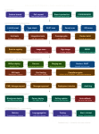

# Enterprise CI/CD pipeline — from commit to production

This folder holds a **reference enterprise delivery model** (healthcare-style example) and documentation for study and interviews.

## Diagram (crisp on screen)

The saved **`enterprise-pipeline-diagram.png`** is a **small raster copy** of the original slide, so it can look **blurry when zoomed**. For a **sharp** diagram:

1. Use the **Mermaid** version below — it scales cleanly on **GitHub**, in **VS Code / Cursor**, and in most Markdown previews.
2. For a **new high-res PNG or SVG**: open [Mermaid Live Editor](https://mermaid.live), paste the diagram code from [`pipeline.mermaid`](pipeline.mermaid), then **Export → PNG/SVG** (choose a larger scale if offered).

```mermaid
flowchart TB
  S1["Stage 1 — Source control<br/>Feature branch · Pull request · Branch protection · CODEOWNERS<br/>(First gate: human review)"]

  S2["Stage 2 — Continuous integration<br/>Parallel hard gates: Lint · Type check · SAST · Secret scan · Unit tests<br/>Integration tests · Coverage gate e.g. ≥80% · Docker build<br/>(No warn-and-continue in enterprise)"]

  S3["Stage 3 — Artifact and container security<br/>Push to private registry · Image scan Trivy / Snyk / Grype<br/>Sign image Cosign · Notary · SBOM supply chain inventory<br/>(Audit evidence for HIPAA / SOC2-style reviews)"]

  S4["Stage 4 — Dev and staging<br/>Ad-hoc deploy · Mirror · Staging · Dynamic DAST on running app<br/>E2E Playwright/Cypress · Load test · Compliance scans HIPAA/SOC2/PCI<br/>(Staging mirrors prod shape; anonymized data in healthcare)"]

  S5["Stage 5 — Approval gate<br/>CAB / Change request · Manager approval · Deployment window<br/>Immutable audit log e.g. ServiceNow<br/>(Human gate before production)"]

  S6["Stage 6 — Production deployment<br/>Blue/green · Canary 5% then ramp · Rolling pod updates<br/>Auto-rollback on error-rate spike<br/>(No single big-bang cutover)"]

  S7["Stage 7 — Observability<br/>Metrics Prometheus + Grafana · Logs Loki/Splunk/ELK · Traces Jaeger/Datadog<br/>Alerts Alertmanager to Slack/PagerDuty to ServiceNow<br/>(Incident drives new commit — loop restarts)"]

  S1 --> S2 --> S3 --> S4 --> S5 --> S6 --> S7
```

### Reference image (may appear soft)

| Asset | Purpose |
|-------|---------|
| [`enterprise-pipeline-diagram.png`](enterprise-pipeline-diagram.png) | Original-style **PNG** (low pixel count — use Mermaid above for clarity) |
| [`pipeline.mermaid`](pipeline.mermaid) | Same graph as **plain Mermaid** for mermaid.live export |
| This README | Stage-by-stage narrative + map to **this** repo |

---

## Stage 1 — Source control

Before any pipeline runs, the code itself is protected. **Feature branches** isolate work, **pull requests** enforce peer review, **branch protection** rules prevent direct pushes to `main`, and **CODEOWNERS** automatically assigns the right reviewer based on which files changed. This is your first quality gate — a **human** one.

**In this repo:** Document branch protection and CODEOWNERS in real GitHub settings; the codebase assumes PR + `main` workflows (`ci.yml`, `ci-cd.yml`).

---

## Stage 2 — Continuous integration (CI)

The key insight in enterprise is that **checks run in parallel** to save time, and every check has a **hard pass/fail** — there is no “warning, but continue.” A **coverage gate** (for example ≥ 80% or the build fails) is especially important in healthcare, where untested code can affect patient data.

**In this repo:** PR **`ci.yml`** runs Ruff, MyPy, Bandit, pytest with a coverage threshold; merge to **`main`** runs **`ci-cd.yml`** (build, Trivy, GHCR, optional Sonar gate, optional Kind/EKS). Tune coverage in workflow / pytest config to match your org’s bar.

---

## Stage 3 — Artifact and container security

This stage is often skipped in tutorials but is **critical** in enterprise. After building the Docker image you **scan** it for known CVEs (OS packages and libraries), **sign** it cryptographically so you can prove it was not tampered with, and produce an **SBOM** — a complete inventory of components inside the image. Regulators and auditors (HIPAA, SOC 2) commonly ask for this evidence chain.

**In this repo:** **Trivy** runs in CI and uploads **SARIF** to GitHub **Code scanning**; image push to **GHCR**. **Cosign / Notary / SBOM** generation are not wired here — they are natural extensions if you want full Stage 3 parity.

---

## Stage 4 — Dev and staging environments

The code is exercised in **non-production** before prod. **Dev** is loose and fast for interactive testing. **Staging** mirrors production — similar infrastructure, config, and data **shapes** (with **anonymized** data in healthcare). **DAST** (Dynamic Application Security Testing) runs against the **running** app, unlike SAST which only reads source code.

**In this repo:** **Kind** + `k8s/overlays/local`, optional **Argo CD**; **staging** overlay and opt-in **EKS** deploy. DAST would be an add-on (e.g. OWASP ZAP in CI against a deployed URL).

---

## Stage 5 — Approval gate

This is what separates many **enterprise** pipelines from minimal startup flows. Nobody deploys to production without **human** sign-off: change ticket (**CAB** / Change Advisory Board), **manager approval**, and a **deployment window** (for example “only Tuesdays 2–4am”). Every action is written to an **immutable audit log** — what HIPAA and SOC 2 auditors review.

**In this repo:** GitHub **Environments** (`staging`, `production`) with required reviewers on `workflow_dispatch` / deploy jobs are the closest built-in pattern; ServiceNow integration is not included.

---

## Stage 6 — Production deployment strategies

Enterprise rarely does a single big-bang cutover. Common patterns:

- **Blue/green** — two full production stacks; flip traffic; keep the old stack for rollback.
- **Canary** — send a small percentage of traffic to the new version, watch errors, ramp to 100%.
- **Rolling update** — replace Kubernetes pods incrementally with zero downtime.

**Auto-rollback** can fire when error rates spike — without waiting for a human.

**In this repo:** Kubernetes **rollouts** via `kubectl` / Argo CD; advanced traffic split (Argo Rollouts, service mesh) is not configured out of the box.

---

## Stage 7 — Observability

Deployment is **not** the end. After release you watch **metrics** (Prometheus + Grafana), **logs** (Loki, Splunk, ELK, etc.), and **traces** (Jaeger, Datadog, etc.). When something breaks, **alerts** flow from Prometheus → Alertmanager → chat or paging (e.g. Slack, PagerDuty) → ticketing (e.g. ServiceNow) — the pattern large enterprises operationalize. Incidents drive a new commit and the **loop** starts again.

**In this repo:** **Docker Compose** runs Prometheus + Grafana + dashboards for local demos; **Kind** exposes app metrics via `/metrics` but does not ship a full in-cluster observability stack by default. Alertmanager-to-ServiceNow is a doc-level reference, not implemented.

---

## Quick map: this diagram ↔ `DevOps-proj`

| Enterprise stage | This repository (today) |
|------------------|---------------------------|
| 1 Source control | GitHub PR / `main`; you configure branch protection + CODEOWNERS |
| 2 CI | `.github/workflows/ci.yml`, `reusable-python-ci.yml` |
| 2–3 Build + scan + registry | `reusable-docker-release.yml`, Trivy SARIF, GHCR |
| 2 Quality gate (optional) | SonarQube / SonarCloud — `sonarqube.yml`, `sonarqube-gate` |
| 3 Sign / SBOM | Not in repo — add Cosign / Syft if needed |
| 4 Dev / staging | Kind, `k8s/overlays/*`, optional EKS staging |
| 5 Approvals | GitHub Environments; external CAB is process |
| 6 Prod strategies | Kustomize + kubectl / Argo; advanced canary optional |
| 7 Observability | `observability/` + Compose; extend for cluster |

---

## Credits

- Diagram and narrative are aligned with a **generic enterprise / healthcare delivery** mental model (example orgs such as **HealthPartners** appear in similar industry diagrams).
- Flowchart **PNG**: **`enterprise-pipeline-diagram.png`** (low-res reference; prefer Mermaid in this README or export from **`pipeline.mermaid`**).

For runnable paths in this project, see [ARCHITECTURE.md](../ARCHITECTURE.md), [END_TO_END_GITHUB.md](../END_TO_END_GITHUB.md), and [DEMO_1HR_SCRIPT.md](../DEMO_1HR_SCRIPT.md).
